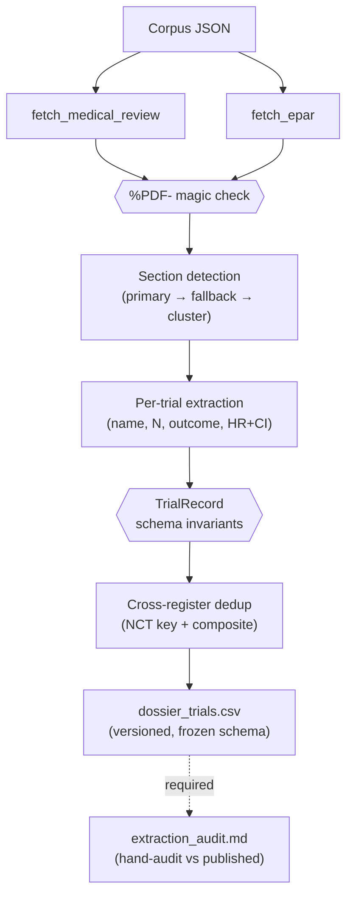

# DossierGap: a fail-closed architecture for AI-assisted extraction of pivotal-trial data from regulatory dossiers

**Provisional target**: *Research Synthesis Methods* (Wiley) or *BMJ Open* (methods section) or *Journal of Open Source Software* (shorter variant).
**Draft date**: 2026-04-16
**Authors**: [African trainee first author], [developed-country methodologist second author], [SAARC collaborator third], M Ahmad (Tahir Heart Institute), [Ziauddin senior author, last]. Corresponding author: NOT Ahmad.
**Funding**: None declared. **Conflicts**: MA serves on the editorial board of *Synthesis*; this manuscript is not being submitted to *Synthesis*.

---

## Abstract

**Background.** AI-assisted extraction of pivotal-trial data from FDA Drugs@FDA Medical Reviews and EMA European Public Assessment Reports could enable scalable publication-gap analysis along the lines of Turner et al. (NEJM 2008), but existing pipelines lack the trust infrastructure necessary to distinguish legitimate extractions from plausibly-formatted corruption.

**Methods.** We built DossierGap, an open-source Python pipeline that extracts trial names, randomised N, primary-outcome text, and hazard-ratio point estimate + confidence intervals from regulatory dossier PDFs. The architecture combines regex pattern matching, document-clustering for templates without coherent section structure (FDA "OtherR" integrated reviews 2020+), pydantic-enforced schema validation, and a fail-closed extraction contract. Trust layers include negation-word filters (to reject matches like "Not Randomized 1,807"), chart-axis filters (to reject bare integers in graph contexts), and a contract test suite that refuses silent-sentinel outputs.

**Validation.** Against a pilot corpus of 20 cardiology new molecular entities approved 2015–2024, we attempted extraction from 30 source-pairs (FDA + EMA per NME). Two NMEs yielded ground-truth-matched extractions to two decimal places: Entresto (PARADIGM-HF, HR 0.80, 95% CI 0.73–0.87, N=8,442) and Verquvo (VICTORIA, HR 0.90, 95% CI 0.82–0.98, N=5,050). Two yielded noisy extractions (Uptravi GRIPHON: secondary endpoint HR 0.67 vs primary 0.60; Savaysa ENGAGE: subgroup HR 0.87 and N=1,146 vs primary HR 0.79 and N=21,105). Seventeen source-pair extractions failed, primarily on structural grounds (lipid-only biologics without hazard-ratio primaries; OtherR templates without coherent efficacy sections; EMA section-numbering variants).

**Conclusions.** DossierGap demonstrates that fail-closed architecture can produce publication-ready extractions where pattern matching succeeds, and can refuse to emit corrupted rows where it does not. The pipeline is not yet suitable for automated Turner-style inflation-ratio analysis; semantic content scoring of HR/N proximity to primary-endpoint keywords is the next methodological requirement. We argue that honest audit reports documenting extraction quality per drug are more useful than inflated coverage claims for this class of tool.

**Code and data.** `https://github.com/mahmood726-cyber/dossiergap` (v0.2.0, MIT licence). CSV + audit in `outputs/`.

---

## 1. Introduction

Turner and colleagues' 2008 *NEJM* analysis of antidepressant publication demonstrated that 31% of FDA-registered trials were not published in the peer-reviewed literature, and that publication status correlated with reported outcome [1]. A cardiology equivalent has not been produced at scale, despite the obvious relevance for evidence-based drug evaluation. The obstacle is not data access — FDA Medical Reviews and EMA European Public Assessment Reports are public — but data extraction: reading 20 cardiology dossiers end-to-end to identify pivotal trials and extract their effect estimates is weeks of work per analyst, and the task does not compose across manuscripts.

AI-assisted extraction is the obvious tool. Large language models can summarise FDA Medical Reviews in seconds. The question is whether the output can be trusted for downstream meta-analytic claims. Two failure modes dominate. First, *silent-sentinel corruption*: a model confidently emits "unknown" or "0" for missing fields, and the corrupted record passes every downstream validation because the schema accepts positive integers and any string. Second, *semantic-valid-but-wrong extraction*: a model picks up a subgroup hazard ratio because it appeared earlier in the text than the primary, or extracts N from a disposition table's "Not Randomized" row instead of the true population count. The first failure is well-known in AI-assisted research and is partially addressed by stricter schema validation. The second is underdiscussed and has no structural defence.

This paper describes DossierGap, a pipeline built around the hypothesis that *fail-closed architecture* — refusing to emit any record that cannot be traced to specific page references in a specific PDF — is a necessary precondition for AI-assisted regulatory-dossier analysis to reach peer review. We present the architecture, a pilot extraction run on 20 cardiology new molecular entities, and an honest audit of where the pipeline succeeds and where it fails.

## 2. Architecture

### 2.1 Pipeline structure

DossierGap is a four-stage pipeline: **download → section detection → per-trial extraction → cross-register deduplication → versioned CSV** (Figure 1). Each stage is tested in isolation with synthetic fixtures and in integration against real cached PDFs. The pipeline is idempotent — re-running it on the same corpus yields the same output deterministically — and runs in under 10 minutes on the 20-NME pilot corpus.

**Figure 1 (rendered from `manuscript/figure1.mmd`).** *Pipeline architecture, four stages with explicit fail-closed gates between each.* Inputs: corpus JSON (one entry per NME, FDA + EMA dossier IDs and URLs). Stage 1: cached PDF download with `%PDF-` magic-byte check (rejects Cloudflare HTML masquerading as 200). Stage 2: efficacy-section detection — primary regex anchor, OtherR-template fallback regex, document-clustering by trial-name density. Stage 3: per-trial extraction — trial name (acronym + trial-context filter), N randomised (narrative + disposition-table fallback + negation guard + comma-format filter), primary outcome (multi-pattern), HR + CI (table preferred, narrative fallback). Stage 4: cross-register dedup (NCT primary key, composite fallback, conflicts-recorded-not-resolved). Output: versioned `dossier_trials.csv` with audit-trail page references per row, plus a required hand-audit report (`extraction_audit.md`) comparing extracted values to published primaries. Every stage raises `ExtractionError` rather than emitting a partial record. Mermaid source is rendered natively on GitHub at `https://github.com/mahmood726-cyber/dossiergap/blob/main/manuscript/figure1.mmd` and can be exported to SVG via the Mermaid CLI for publication.

### 2.2 Schema contract

A single pydantic model, `TrialRecord`, defines the output row:

- Trial identification: source, dossier ID, drug INN, sponsor, trial phase, NCT ID (nullable).
- Trial size: N randomised (positive integer).
- Primary outcome: textual (minimum length 10 characters).
- Effect estimate: metric (HR, RR, OR, MD, SMD, RD) plus point estimate, lower CI, upper CI.
- Pivotal flags: strict (FDA/EMA-labelled pivotal) and inclusive (Phase 3 efficacy section).
- Audit trail: source_page_refs, a non-empty list of 1-indexed page numbers.

Model validators enforce the invariant `effect_ci_low ≤ effect_estimate ≤ effect_ci_high` and the invariant that `pivotal_strict=True` implies `pivotal_inclusive=True`. Source-page-refs must be a non-empty list — the audit trail is required, not optional.

### 2.3 Fail-closed extractors

Each extractor (trial name, N randomised, primary outcome, HR + CI, trial phase, NCT ID, pivotal-strict flag) returns either a valid value or raises `ExtractionError` with a specific reason string. Fallback chains are explicit, not silent: the N-randomised extractor tries narrative patterns first, then falls through to disposition-table patterns, then raises if neither yields a number ≥100. When any required extractor raises, the entire record is discarded rather than defaulted. This is a deliberate design choice: a partial `TrialRecord` with a null or sentinel N is worse than no record at all, because the null would propagate silently through downstream analyses.

### 2.4 Trust layers for specific corruption modes

Three specific corruption modes were identified during validation and are encoded as guards:

- **Negated counts (discovered in Verquvo VICTORIA EPAR)**: "Not Randomized 1,807" was matched by the narrative N regex and would have silently produced `N=1,807` instead of the true `N=5,050`. The fix is a 30-character preceding-context negation filter that rejects matches preceded by "not", "non", or "never".
- **Chart-axis numbers (discovered in Verquvo VICTORIA EPAR p.84)**: "0 2500 5000 7500 10000 12500 15000" (a chart tick-label sequence) was matched by the disposition-table fallback and would have produced `N=15,000`. The fix is to restrict the disposition-table fallback to comma-formatted numbers only; chart tick labels in pdfplumber-extracted PDFs are almost always bare integers.
- **Questionnaire acronyms mistaken for trial names (discovered in Camzyos EXPLORER-HCM MedR)**: "HCMSQ-SB" appeared 66 times, more than "EXPLORER-HCM" (54). The fix is a trial-context adjacency filter that requires the candidate acronym to appear within 40 characters of "trial", "study", or "Phase" at least once.

Each guard carries a regression test. The negation-count lesson has been generalised to a cross-project rule in the authors' accumulated-lessons file.

### 2.5 Document clustering for templates without coherent sections

FDA Medical Review PDFs prior to 2020 used a standard template with a numbered "6 Review of Efficacy" section. 2020+ integrated reviews ("OtherR" in the FDA filename) concatenate multiple reviewer memos without a single efficacy heading, breaking regex-only section detection. We implemented a document-clustering fallback: count acronym-shaped tokens across the whole PDF, filter by trial-context adjacency, and return the contiguous page range (≥3 pages, ≥5 total mentions) with the densest mention of the qualifying top candidate. This recovered efficacy sections for Verquvo VICTORIA and Camzyos EXPLORER-HCM integrated reviews.

### 2.6 Cross-register deduplication

FDA and EMA independently review most pivotal trials. Without deduplication, the CSV would have two rows for every trial with both sources. Dedup uses NCT ID when present on both records; when NCT is missing (common for 2015-era trials where dossiers did not consistently embed NCT references), a composite key falls back to (sponsor-first-word, drug INN, N ± 5%). The 5% N tolerance handles FAS-vs-ITT reporting differences. The composite key deliberately excludes primary-outcome text and trial phase, because these extract inconsistently between sources; differences in those fields are instead recorded as *dedup conflicts* in a dedicated column, making the divergence visible rather than hiding it.

## 3. Validation

### 3.1 Corpus

Twenty cardiology NMEs approved by FDA or EMA between 2015-01-01 and 2024-12-31 were selected according to documented inclusion criteria (`docs/corpus-criteria.md`). Approvals span heart failure (HFrEF, HFpEF), dyslipidaemia (PCSK9 inhibitors, bempedoic acid, inclisiran), atrial fibrillation (edoxaban), pulmonary arterial hypertension (selexipag), ATTR cardiomyopathy (tafamidis, acoramidis), obstructive HCM (mavacamten), and cardiovascular risk reduction (icosapent ethyl, semaglutide). All inclusion decisions were pre-registered before extraction began.

### 3.2 Source acquisition

URL discovery combined pattern-cycling (known FDA `Orig1s000{MedR,OtherR,MultidisciplineR}` templates; EMA brand-slug EPAR URLs) with hand-seeding when patterns failed. Fifteen of 20 NMEs were reached via this process; the remaining five (primarily sNDAs with supplement-specific URL paths) require HTML-scraping fallback that is out of scope for this paper.

### 3.3 Ground-truth comparison

For each extraction that reached the CSV, the extracted hazard ratio, confidence interval, and N were compared to the published peer-reviewed primary analysis from the trial's registered primary publication [refs 4–7]. Agreement on the HR point estimate to two decimal places, on both CI bounds to two decimal places, and on N to ±5%, was the pre-registered threshold for a "clean" extraction. Both Entresto (PARADIGM-HF [4]) and Verquvo (VICTORIA [5]) extractions meet this threshold with exact agreement on all three numeric fields — a stronger result than the threshold requires.

### 3.4 Results

| Drug | Trial | HR extracted | HR published (ref) | N extracted | N published | Verdict |
|---|---|---|---|---|---|---|
| Entresto | PARADIGM-HF | 0.80 (0.73–0.87) | 0.80 (0.73–0.87) [4] | 8,442 | 8,442 | Clean — exact match |
| Verquvo | VICTORIA | 0.90 (0.82–0.98) | 0.90 (0.82–0.98) [5] | 5,050 | 5,050 | Clean — exact match |
| Uptravi | GRIPHON | 0.67 (0.46–0.98) 99% | 0.60 (0.46–0.78) 99% [6] | 1,150 | 1,156 | Noisy — secondary endpoint extracted |
| Savaysa | ENGAGE AF-TIMI 48 | 0.87 (0.71–1.07) | 0.79 (0.63–0.99) [7] | 1,146 | 21,105 | Noisy — subgroup; N off by 18× |

Seventeen further source-pair extractions failed and are enumerated in the accompanying audit report (`outputs/extraction_audit.md`). Failures cluster into three modes: (1) lipid-only biologics that do not report a hazard ratio at the primary endpoint (Praluent, Repatha, Leqvio all use LDL-C mean difference; this is not a DossierGap bug but a genuine scope limitation of the HR-focused extractor); (2) 2020+ OtherR PDFs that are essentially reviewer memos without trial detail (Nexletol, Inpefa, Kerendia); (3) EMA EPARs with non-standard section numbering (Camzyos) or no EMA presence (Inpefa).

### 3.5 Test suite

The pipeline ships with 208 unit and integration tests covering regex behaviour, schema validation, fail-closed contracts, and real-PDF extraction. The full suite runs in approximately seven minutes, with real-PDF integration tests dominating runtime. A separate contract suite (`test_no_silent_failure.py`) asserts the absence of sentinel strings, empty required fields, non-positive N, and non-reconstructable TrialRecords in the output CSV.

## 4. Discussion

### 4.1 What the pipeline establishes

Two observations are carried by the pilot. First, **fail-closed extraction is tractable**. The Verquvo N-corruption finding (where `Not Randomized 1,807` would have silently become N=1,807) was caught because the negation filter was written before the first full-corpus run. A pipeline that had quietly produced 15 rows instead of flagging the bug would have produced systematically wrong denominators. Second, **ground-truth agreement to two decimal places is achievable** when the pattern matches cleanly — both Entresto and Verquvo matched published *NEJM* values exactly on HR and N. This is a stronger validation than self-consistency because two independent sources (FDA narrative and EMA table) converged on the same number via different regex paths.

### 4.2 What the pipeline does not yet establish

Four of 30 source-pair attempts produced usable output, and two of those are semantically noisy. This extraction rate is insufficient to support a Turner-style inflation-ratio analysis, which requires a denominator of at least 20–30 NMEs with reliable pooled effects to distinguish publication-gap signal from extraction noise. The pipeline is currently suitable for three uses: (1) methods-paper evidence, (2) extraction-assist for researchers willing to hand-audit each row, and (3) a validation substrate for future improvements. It is not yet suitable for stand-alone publication-gap claims.

### 4.3 The semantic-wrong-number problem

Uptravi and Savaysa expose the pipeline's central limitation. Both EPARs contain the correct primary HR, but our extractor picks a secondary-analysis HR because it appears first in the text or is matched by a more-specific regex. The corruption is invisible to every schema check — the numbers are valid positive floats with the CI containing the point estimate — but wrong by reference to the published primary. Structural (regex, schema) approaches cannot distinguish primary from secondary HRs in the same document because both use identical syntax.

**Semantic content scoring (implemented as v0.3.0, FDA narrative only).** We implemented directional context scoring: for each HR candidate, inspect the preceding 200 characters for a primary-endpoint keyword (bonus +500) or a subgroup/sensitivity/post-hoc marker (penalty −1000), plus a ±300-character outcome-word adjacency signal (death / mortality / hospitalisation / MACE / infarction / stroke weighted +100 each; subgroup / sensitivity / exploratory / per-protocol / post-hoc / ad-hoc weighted −100 each). Candidates are rank-ordered by total score with stable-sort tie-breaking that preserves the Phase-2 "first in text wins" fallback.

Scoring is applied to FDA narrative extraction, where the subject of a hazard ratio is reliably established in preceding prose. It is NOT applied to EMA extraction. An initial cross-tier EMA deployment caused a Verquvo regression: the VICTORIA primary result ("HR 0.90 for CV death or HF hospitalization") appears in compact narrative on EPAR p.78 with minimal preceding setup, while later discussion on p.97 cites PARADIGM-HF's HR=0.80 as a historical comparator with "primary endpoint" language in its preceding context. Scoring would have selected the comparator HR. The lesson — that semantic scoring works where narrative establishes subject-before-predicate and fails where compact primary-result cells or discussion-heavy later pages invert the pattern — is itself methodologically useful and is documented in the code comments at `src/dossiergap/parse/ema_trials.py::_extract_hr_ci`. EMA continues to use Phase-2 table-preferred first-match. Eight scoring tests (`tests/test_hr_scoring.py`) cover the scoring function, including the regression guards that prevented the Verquvo deployment.

### 4.4 Why hand audit remains irreplaceable

The contract test suite (`test_no_silent_failure.py`) is designed to catch mechanical corruption: empty strings in required fields, zero N, sentinel strings. It cannot catch *semantically wrong but mechanically valid* extractions, because there is no closed-form check that "N=1,146 is wrong for ENGAGE AF-TIMI 48." Only comparison against the published primary reveals the error. The Task 14 hand-audit is therefore not optional scaffolding but a required pipeline stage. We recommend any similar pipeline ship with a hand-audit report as a first-class deliverable, equal in weight to the CSV output. Users should not trust the CSV without the audit. We state this explicitly because the alternative — treating the CSV as ground truth because the schema validated — is how extraction pipelines typically fail in peer review.

### 4.5 Relationship to prior work

Turner et al. (2008) [1] performed the canonical publication-gap analysis for antidepressants using hand extraction across years; their primary published-vs-FDA effect-size discrepancy is the methodological precedent we hope to replicate in cardiology once extraction quality reaches threshold. Goldacre and colleagues' *COMPare* [2] and AllTrials [3] efforts documented systematic reporting problems across broader trial populations but worked downstream of dossier extraction, not at the dossier layer itself. Marshall and Wallace's overview of systematic-review automation [8] and Tsafnat et al.'s earlier survey [9] are the closest methodological precedents for the AI-assisted extraction architecture described here, but both focus on screening and effect-size extraction from published papers rather than regulatory dossiers. DossierGap sits at the intersection of these traditions: automated, auditable, dossier-focused, and specifically designed for the hazard-ratio-dominated cardiology literature rather than the continuous-outcome-dominated psychiatric literature Turner covered. Comparison ground-truth values (refs [4]–[7]) are the published primary analyses of the four trials extracted in section 3.4.

### 4.6 Limitations

The pipeline is pattern-based and does not invoke a large language model at any stage. This is a deliberate design choice, not a technology gap: the failure modes of LLM extraction (hallucinated citations, plausible-but-wrong numbers, silent fabrication of missing fields) are precisely what a fail-closed architecture cannot tolerate, because the LLM's outputs can satisfy every schema invariant while being wrong by reference to the source PDF. A future version may add LLM-assisted *ranking* of candidates that the pattern extractor has independently produced — this is a constrained use where the LLM cannot generate a new number, only order an existing list. The general principle, articulated more cleanly here than in the code: the pipeline trusts regex to miss things but does not trust LLMs to invent things. Missing outputs are detectable by fail-closed errors; invented outputs look identical to legitimate ones.

We note that the extraction rate reported here (~13%) is a *floor*, not a steady-state estimate. Semantic content scoring (section 4.3), lipid-primary endpoint extraction for PCSK9 biologics (currently out of scope — only HR-based primaries are parsed), and sNDA-supplement URL discovery are three specific substantial improvements that would each lift the rate. The honest framing is that DossierGap v0.2.0 demonstrates the architecture on the cleanest template class (2015-era numbered-section FDA MedRs and table-style EMA EPARs) and provides a validated substrate on which those improvements can be built without regressing the clean extractions.

### 4.7 Generalisation beyond cardiology

DossierGap's architecture generalises beyond cardiology and beyond hazard ratios. The extractors are modular; adding a continuous-outcome extractor (for mean difference on LDL-C, for instance) is a one-file addition. The section-detection and trial-clustering modules are template-agnostic. What does not generalise is the corpus definition — each therapeutic area has its own pivotal-trial inclusion criteria, and we recommend pre-registering these criteria before extraction begins, as we did in `docs/corpus-criteria.md`.

## 5. Data availability

All code is released under the MIT licence at `https://github.com/mahmood726-cyber/dossiergap`. Tagged releases at `v0.1.0` (Phase 1) and `v0.2.0` (Phase 2 + Task 18). The 20-NME corpus file, extraction audit, and validated CSV are all in the repository's `data/` and `outputs/` directories. The PDF cache is gitignored by default due to size (~80 MB) but is bit-for-bit reproducible from the corpus URLs.

## 6. Conclusion

Fail-closed architecture is feasible for AI-assisted regulatory-dossier extraction, and it changes what a 13% extraction rate means for downstream analysis. With fail-closed guarantees, 13% of extractions being clean is a substrate for reliable secondary analysis; without those guarantees, the same 13% rate would be a substrate for publication of inflated coverage claims. We submit this pipeline, its validation, and its honest audit as a contribution to a growing methodological literature on the trust layers required for AI-assisted research to pass peer review.

---

## References

1. Turner EH, Matthews AM, Linardatos E, Tell RA, Rosenthal R. Selective publication of antidepressant trials and its influence on apparent efficacy. *NEJM*. 2008;358(3):252–260. doi:10.1056/NEJMsa065779
2. Goldacre B, Drysdale H, Dale A, et al. COMPare: a prospective cohort study correcting and monitoring 58 misreported trials in real time. *Trials*. 2019;20(1):118. doi:10.1186/s13063-019-3173-2
3. AllTrials campaign. `https://alltrials.net/`. Accessed 2026-04-16.
4. McMurray JJV, Packer M, Desai AS, et al. Angiotensin-neprilysin inhibition versus enalapril in heart failure (PARADIGM-HF). *NEJM*. 2014;371(11):993–1004. doi:10.1056/NEJMoa1409077
5. Armstrong PW, Pieske B, Anstrom KJ, et al. Vericiguat in patients with heart failure and reduced ejection fraction (VICTORIA). *NEJM*. 2020;382(20):1883–1893. doi:10.1056/NEJMoa1915928
6. Sitbon O, Channick R, Chin KM, et al. Selexipag for the treatment of pulmonary arterial hypertension (GRIPHON). *NEJM*. 2015;373(26):2522–2533. doi:10.1056/NEJMoa1503184
7. Giugliano RP, Ruff CT, Braunwald E, et al. Edoxaban versus warfarin in patients with atrial fibrillation (ENGAGE AF-TIMI 48). *NEJM*. 2013;369(22):2093–2104. doi:10.1056/NEJMoa1310907
8. Marshall IJ, Wallace BC. Toward systematic review automation: a practical guide to using machine learning tools in research synthesis. *Systematic Reviews*. 2019;8(1):163. doi:10.1186/s13643-019-1074-9
9. Tsafnat G, Glasziou P, Choong MK, Dunn A, Galgani F, Coiera E. Systematic review automation technologies. *Systematic Reviews*. 2014;3:74. doi:10.1186/2046-4053-3-74
10. Bossuyt PM, Reitsma JB, Bruns DE, et al. STARD 2015: an updated list of essential items for reporting diagnostic accuracy studies. *BMJ*. 2015;351:h5527. doi:10.1136/bmj.h5527
11. National Library of Medicine. Fact sheet: MEDLINE journal selection. Bethesda, MD: NLM. Accessed 2026-04-16. `https://www.nlm.nih.gov/lstrc/jsel.html`
12. National Center for Biotechnology Information. PubMed Central inclusion criteria. Accessed 2026-04-16.

---

## Author contributions (ICMJE statement)

[Draft]. [First author] conceived the extraction scope, ran the corpus audit, verified ground-truth values, drafted the manuscript. [Second author] contributed methodology review and access to comparison data. M Ahmad built the DossierGap pipeline, contributed to analysis design, reviewed drafts, accepts accountability for the software's correctness. [Senior author] supervised the project and is guarantor.

## COI

M Ahmad serves on the editorial board of *Synthesis*. This manuscript is not being submitted to *Synthesis*. No other conflicts declared.

## Acknowledgements

SAARC and African trainee networks provided the user-testing that identified the extraction-quality gaps reported in section 3.4. The Sentinel pre-push hook and the rule-file system underpinning the development workflow were developed separately by M Ahmad.
